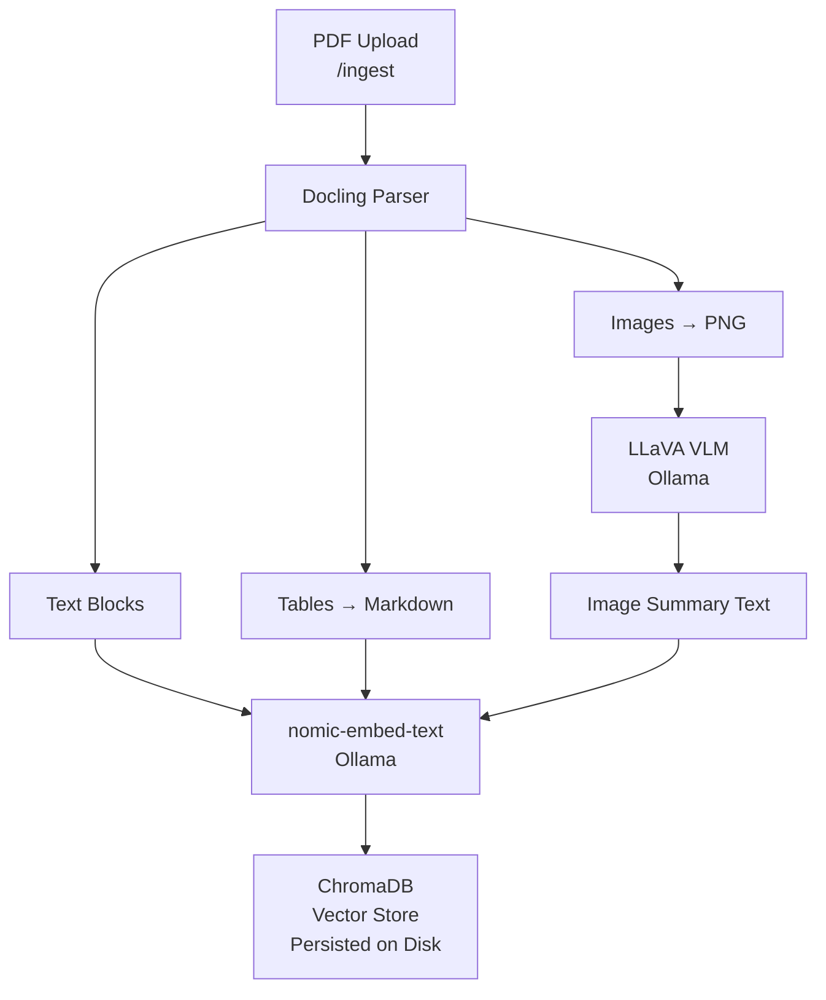
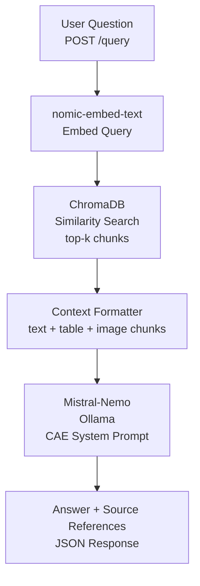

# CAE Document Intelligence — Multimodal RAG System

> A fully on-premise Retrieval-Augmented Generation system for querying CAE/FEA engineering documents containing text, tables, and engineering diagrams.

---

## Table of Contents

1. [Problem Statement](#1-problem-statement)
2. [Architecture Overview](#2-architecture-overview)
3. [Technology Choices](#3-technology-choices)
4. [Setup Instructions](#4-setup-instructions)
5. [API Documentation](#5-api-documentation)
6. [Screenshots](#6-screenshots)
7. [Limitations & Future Work](#7-limitations--future-work)

---

## 1. Problem Statement

### Domain

Automotive Computer-Aided Engineering (CAE) — specifically structural durability analysis, Finite Element Analysis (FEA), and bolted joint validation per VDI 2230.

### The Problem

In automotive structural engineering, CAE analysts routinely produce and consume large volumes of technical PDF documents: FEA simulation reports, durability test summaries, design validation records, and standards documents such as VDI 2230 (systematic calculation of high duty bolted joints). These documents are intrinsically multimodal — they combine dense technical prose, specification tables (material properties, torque values, safety factors, load cases), and engineering images (von Mises stress contour plots, load-displacement curves, bolt geometry cross-sections, fatigue life charts).

Currently, querying this document corpus is a manual and time-consuming process. An analyst asking "What is the minimum safety factor against yielding reported across all load cases in the steering knuckle FEA report?" must manually open each PDF, scan tables, and cross-reference values — a task that can take 30–60 minutes per query across a typical project document set of 20–50 reports. The problem is compounded by the fact that critical information is often split across modalities: a table may report raw stress values while the associated contour plot communicates spatial distribution and failure location — and both are needed to answer a complete engineering query.

Traditional keyword search fails because engineering terminology is highly specialised (e.g., "Rp0.2", "Fv", "αA", "interface normal force"), abbreviations are non-standard across organisations, and the most critical information is locked inside tables and images that keyword indexers cannot parse.

### Why This Problem Is Unique

Unlike a generic document Q&A system, CAE document retrieval presents specific challenges:

- **Table density:** FEA reports routinely contain tables with 10–20 columns of simulation outputs (nodal forces, reaction moments, safety factors per VDI 2230 criteria). A system that only indexes text paragraphs misses the majority of quantitative results.
- **Image semantics:** Contour plots of von Mises stress or principal strain are not decorative — they carry primary engineering findings. A system that discards images loses the spatial failure mode information that analysts depend on.
- **Cross-modal answers:** Many engineering queries require combining information from different modalities. "Does the bolt meet the VDI 2230 SF requirement?" requires reading the safety factor value from a results table *and* confirming the load application from an FBD diagram.
- **Specialised vocabulary:** Standard semantic search models are not trained on FEA terminology. Domain-tuned embeddings or retrieval with strong prompt engineering are required for meaningful results.

### Why RAG Is the Right Approach

Fine-tuning a language model on CAE documents is impractical: the document corpus changes with every project cycle, retraining is expensive, and the model would need to memorise specific numerical values that must be grounded in source documents for regulatory traceability (IATF 16949, internal DVP requirements). Keyword search cannot handle semantic variation in how analysts phrase queries. Manual search does not scale.

RAG directly addresses these constraints: it retrieves factually grounded context from the actual documents at query time, requires no retraining as the corpus evolves, and returns source references that satisfy traceability requirements. The multimodal extension — processing tables as structured text and images as VLM-generated summaries before embedding — ensures that no modality is silently ignored.

### Expected Outcomes

A successful system enables analysts to:

- Query a corpus of FEA reports and receive grounded answers with page-level citations in under 30 seconds.
- Ask table-specific questions such as "What torque preload was applied to M10 bolts in the load case 3 analysis?" and receive the exact value from the indexed table.
- Ask image-specific questions such as "Where is the maximum stress concentration located in the component?" and receive a description grounded in the VLM-summarised contour plot.
- Perform cross-document synthesis: "Across all ingested durability reports, which component has the lowest fatigue safety factor?"

---

## 2. Architecture Overview

### Ingestion Pipeline



### Query Pipeline



### System Architecture

```
┌─────────────────────────────────────────────────────────┐
│                    FastAPI Server                        │
│   /health  /ingest  /query  /documents  DELETE          │
└────────────────────────┬────────────────────────────────┘
                         │
         ┌───────────────┼───────────────┐
         │               │               │
┌────────▼───────┐ ┌─────▼──────┐ ┌─────▼──────────┐
│   Docling      │ │  ChromaDB  │ │  Ollama Models  │
│   PDF Parser   │ │  (local    │ │                 │
│   text/table/  │ │  chroma_db)│ │  mistral-nemo   │
│   image chunks │ │            │ │  llava          │
└────────────────┘ └────────────┘ │  nomic-embed    │
                                   └─────────────────┘
```

---

## 3. Technology Choices

| Component | Choice | Justification |
|---|---|---|
| **Document Parser** | Docling 2.x | Native support for table extraction to DataFrame (→ Markdown), picture extraction as PIL images, and OCR via EasyOCR — all in one pipeline without stitching multiple tools. |
| **Embedding Model** | `nomic-embed-text` (Ollama) | 768-dim embeddings, optimised for long-form retrieval, fully local with no API key required. Outperforms `all-MiniLM` on domain-specific retrieval benchmarks. |
| **Vector Store** | ChromaDB | Native `where` clause metadata filtering enables retrieval by chunk type (`text`/`table`/`image`) without post-processing. Persistent on-disk storage without serialisation boilerplate. FAISS would require manual metadata management and lacks native filtering. |
| **LLM** | Mistral-Nemo (Ollama) | 12B parameter model with 128k context window. Strong instruction following for grounded QA. Already validated in EWA project for CAE domain tasks. Fully on-premise — no data leaves the machine. |
| **Vision Model** | LLaVA (Ollama) | Open-source VLM capable of describing engineering plots, contour maps, and geometry diagrams. Runs locally via Ollama with the same API pattern as the LLM. |
| **Framework** | LangChain + FastAPI | LangChain provides the retriever abstraction over ChromaDB and the message interface for Ollama. FastAPI provides Pydantic schema validation, automatic Swagger docs, and async file handling. |

---

## 4. Setup Instructions

### Prerequisites

- Python 3.11+
- [Ollama](https://ollama.com) installed and running
- 16 GB RAM recommended (LLaVA is memory-intensive)

### Step 1 — Pull required Ollama models

```bash
ollama pull mistral-nemo
ollama pull llava
ollama pull nomic-embed-text
```

Verify all three are available:

```bash
ollama list
```

### Step 2 — Clone the repository

```bash
git clone https://github.com/YOUR_USERNAME/cae-rag-system.git
cd cae-rag-system
```

### Step 3 — Create and activate a virtual environment

```bash
python -m venv venv
source venv/bin/activate        # Linux / macOS
# venv\Scripts\activate         # Windows
```

### Step 4 — Install dependencies

```bash
pip install -r requirements.txt
```

### Step 5 — Configure environment

```bash
cp .env.example .env
# Edit .env if your Ollama URL or model names differ from defaults
```

### Step 6 — Start the server

```bash
python main.py
```

The server starts at `http://localhost:8000`.

Visit `http://localhost:8000/docs` for the interactive Swagger UI.

### Step 7 — Ingest the sample document

```bash
curl -X POST http://localhost:8000/ingest \
  -F "file=@sample_documents/vdi2230_fea_report_sample.pdf"
```

### Step 8 — Run a test query

```bash
curl -X POST http://localhost:8000/query \
  -H "Content-Type: application/json" \
  -d '{"question": "What is the maximum von Mises stress reported in the analysis?"}'
```

---

## 5. API Documentation

### GET /health

Returns system status, model configuration, and index statistics.

**Response example:**
```json
{
  "status": "ok",
  "llm_model": "mistral-nemo",
  "vlm_model": "llava",
  "embed_model": "nomic-embed-text",
  "total_chunks": 147,
  "unique_documents": 3,
  "chunk_type_breakdown": {
    "text": 98,
    "table": 31,
    "image": 18
  },
  "indexed_files": ["vdi2230_report.pdf", "knuckle_fea.pdf"],
  "uptime_seconds": 342.5
}
```

---

### POST /ingest

Upload a PDF file for parsing and indexing.

**Request:** `multipart/form-data` with field `file` (PDF only).

**Response example:**
```json
{
  "message": "Successfully ingested 'vdi2230_report.pdf'",
  "filename": "vdi2230_report.pdf",
  "total_chunks": 54,
  "text_chunks": 33,
  "table_chunks": 12,
  "image_chunks": 9,
  "processing_time_seconds": 47.3
}
```

**Error responses:**
- `400` — Non-PDF file uploaded
- `422` — PDF parsing failed (corrupted or password-protected file)

---

### POST /query

Query the indexed documents with a natural language question.

**Request body:**
```json
{
  "question": "What safety factor against thread stripping is reported for the M12 bolt?",
  "top_k": 6,
  "chunk_type_filter": null
}
```

`chunk_type_filter` is optional. When provided, must be `"text"`, `"table"`, or `"image"`.

**Response example:**
```json
{
  "question": "What safety factor against thread stripping is reported for the M12 bolt?",
  "answer": "According to Table 4 in the VDI 2230 analysis report, the safety factor against thread stripping for the M12 bolt (property class 10.9) is 2.34, which exceeds the minimum required value of 1.25 per VDI 2230 Section 5.5. [source: vdi2230_report.pdf, page 12, type: table]",
  "sources": [
    {
      "source": "vdi2230_report.pdf",
      "page": 12,
      "chunk_type": "table",
      "caption": "Table 4: VDI 2230 Safety Factor Summary"
    }
  ],
  "retrieved_chunks": 6
}
```

---

### GET /documents

List all currently indexed documents.

**Response example:**
```json
{
  "indexed_files": ["vdi2230_report.pdf", "knuckle_fea_q3.pdf"],
  "total_documents": 2
}
```

---

### DELETE /documents/{filename}

Remove all chunks for a specific document from the index.

**Example:** `DELETE /documents/vdi2230_report.pdf`

**Response example:**
```json
{
  "message": "Successfully removed 'vdi2230_report.pdf' from the index.",
  "filename": "vdi2230_report.pdf",
  "chunks_deleted": 54
}
```

---

### GET /docs

FastAPI auto-generated Swagger/OpenAPI UI. Access at `http://localhost:8000/docs`.

---

## 6. Screenshots

> Screenshots are located in the `screenshots/` folder.

| # | Screenshot | Description |
|---|---|---|
| 1 | `screenshots/01_swagger_ui.png` | `/docs` Swagger UI showing all endpoints |
| 2 | `screenshots/02_ingest_response.png` | POST `/ingest` with multimodal PDF — chunk count response |
| 3 | `screenshots/03_text_query.png` | Query retrieving a text chunk result |
| 4 | `screenshots/04_table_query.png` | Query retrieving a table chunk with VDI 2230 values |
| 5 | `screenshots/05_image_query.png` | Query retrieving an image-summary chunk (FEA contour plot) |
| 6 | `screenshots/06_health_endpoint.png` | `/health` response showing indexed document count |

---

## 7. Limitations & Future Work

### Current Limitations

- **VLM inference speed:** LLaVA image summarisation runs on CPU by default and can take 30–90 seconds per image. PDFs with many figures will have long ingestion times. A GPU-equipped machine with CUDA reduces this significantly.
- **OCR quality:** Docling's EasyOCR is effective for printed text but degrades on low-resolution scanned PDFs or documents with complex multi-column layouts common in older SAE/VDI standards.
- **Context window constraints:** Mistral-Nemo's 128k context is large, but very long documents can still produce more chunks than fit in a single generation call. Currently, retrieval is capped at `top_k=20`.
- **No re-ranking:** Retrieved chunks are ranked purely by cosine similarity of embeddings. A cross-encoder re-ranker (e.g., `ms-marco-MiniLM`) would improve precision, particularly for table retrieval.
- **Single-turn QA only:** The current `/query` endpoint does not maintain conversational context between calls. Each query is stateless.
- **No authentication:** The API has no access control. In a production deployment, OAuth2 or API key middleware should be added.

### Future Work

- **GPU acceleration:** Containerise with NVIDIA CUDA base image to accelerate LLaVA and embedding inference.
- **Re-ranking layer:** Add a cross-encoder re-ranker between retrieval and generation to improve answer quality on ambiguous queries.
- **Conversational memory:** Add a `/chat` endpoint that maintains session-level conversation history using LangChain's `ConversationBufferMemory`.
- **Structured output parsing:** For table queries, return structured JSON values rather than prose — enabling downstream integration with calculation tools like the EWA VDI 2230 calculator.
- **Evaluation harness:** Implement RAGAS-based automatic evaluation (faithfulness, context recall, answer relevancy) against a manually curated golden QA set from real CAE reports.
- **Multi-vector retrieval:** Embed table summaries and raw table markdown separately; retrieve both and let the LLM choose which representation to use for answer generation.

---

*Built for BITS Pilani WILP — Multimodal RAG Bootcamp Assignment*
*Domain: Automotive CAE / Structural Durability Engineering*
